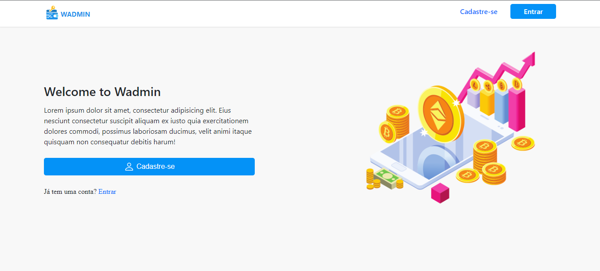
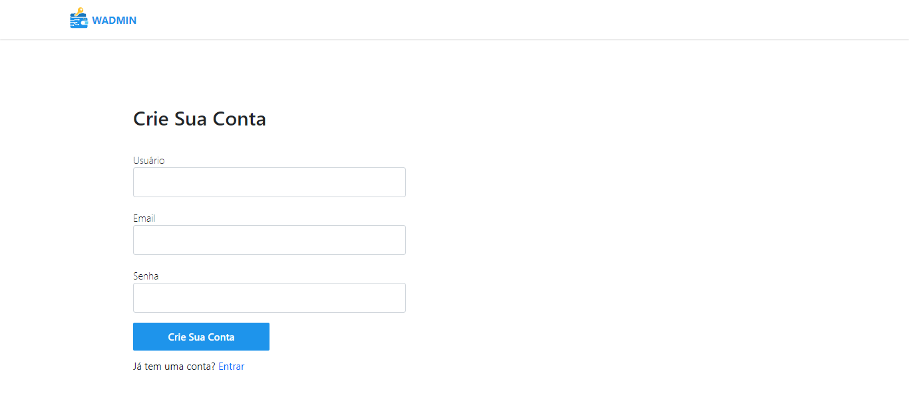
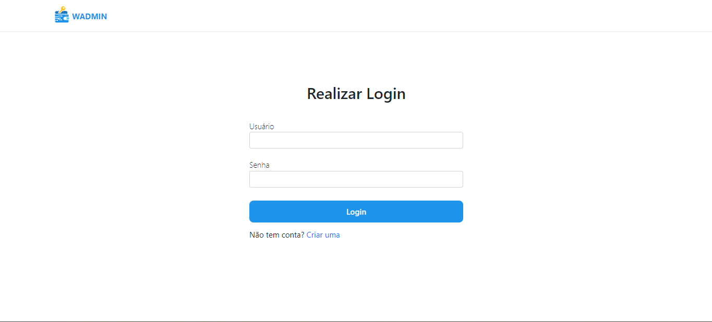

# WADMIN - Uma plataforma fictícia de gerenciamento de criptomoedas

### OBS: plataforma em desenvolvimento

                                        
### Back End: [Repository](https://github.com/jeanevenx/api-wadmin)

    

Projetei e desenvolvi este sistema como projeto final para o curso de desenvolvimento fullstack do Transforma Tec (parceria da DIO com o Grupo Carrefour).
  

PAGINA DE INICIO

  

PAGINA DE CADASTRO

  

PAGINA DE LOGIN

